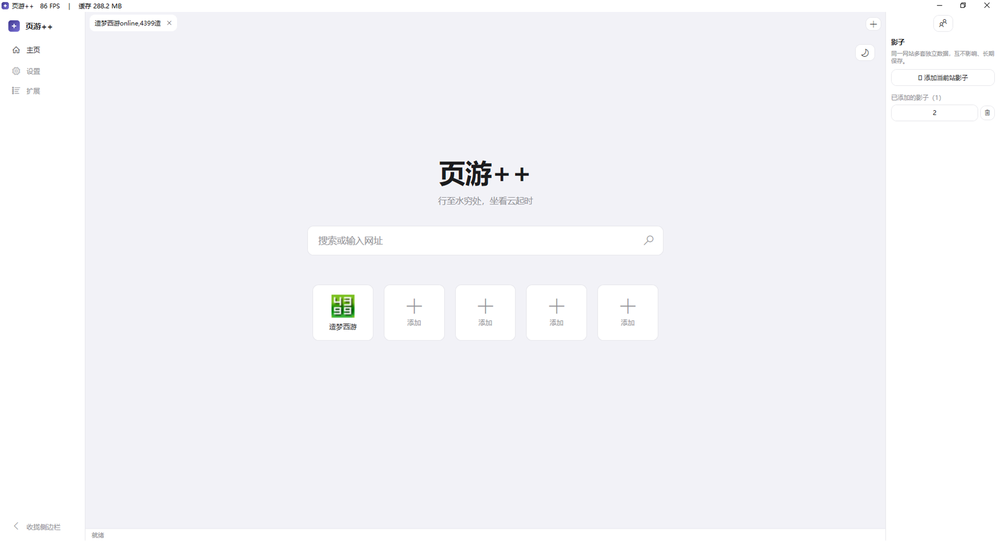

<div align="center">


# 页游++（YeyouPlusPlus）

**Windows Flash 页游浏览器 —— 真·Flash 内核 + 游戏变速齿轮，开箱即用**

   

主页：快捷入口 + 必应搜索，一目了然



游戏内变速（5x）与「影子」小号多开面板


</div>

## ✨ 特性

- **真 Flash 内核**：内置 CEF 84（Chromium 84）+ Adobe Flash PPAPI 插件（34.0.0.330 x64），无需任何配置即可畅玩 4399 等平台的经典 Flash 页游（如造梦西游系列）
- **游戏变速齿轮**：基于 MinHook 内联挂钩，**全覆盖 17 个时间 / 等待函数**（GetTickCount、QueryPerformanceCounter、Sleep、WaitForSingleObject、SetTimer、timeSetEvent 等），主界面与**游戏副本内均稳定生效**，0.5x ~ 5x 自由调速，倍率切换无缝衔接
- **影子（小号多开）**：一键克隆当前页面到独立实例，Cookie / 缓存 / 会话完全隔离，大小号同屏双开
- **多标签浏览**：原生标签栏，支持新建、切换、关闭；界面实时显示 FPS 与内存占用
- **主页快捷入口**：5 个快捷按钮一键进入常玩游戏网址，图标自动抓取网站 favicon
- **必应搜索**：主页大搜索框，网址直达 / 关键词必应搜索
- **iOS 风格界面**：清新圆角设计，支持日间 / 夜间两种主题一键切换
- **网页缩放**：50% ~ 200% 页面缩放
- **缓存管理**：实时监测缓存体积，达到临界值提醒、危险值自动清理；支持一键清除 Cookies 与缓存
- **检查更新**：启动自动检查，发现新稳定版时红点提醒；支持在设置中浏览全部版本并覆盖安装（配置与数据保留）
- **自定义路径**：数据存储路径、下载保存路径均可自定义
- **硬件加速**：默认启用 GPU 合成渲染

## 📥 下载

前往 [Releases](https://github.com/bilibilibaiyun/yeyou-plus-plus/releases) 页面下载 `YeyouPlusPlus_x.y.z_x64_Setup.exe`。

> 标注「**稳定版**」的 Release 推荐普通用户下载；标注「**测试版**」的为开发中的版本，可能不稳定。

## ⚡ 变速齿轮原理

变速模块以 Rust 编写，编译为独立 DLL 随主程序注入浏览器渲染进程：

1. 通过 `MH_CreateHookApiEx` 对 `kernel32` / `winmm` / `user32` 的 **17 个时间与等待函数**建立内联跳板；
2. 时间读取类函数返回「锚定式缩放时间」：`base_hook + (now - base_real) × speed`，倍率变化时重新锚定，时间轴平滑无跳变；
3. 等待类函数（Sleep / WaitForSingleObject / SetTimer 等）按 `超时 ÷ speed` 缩放，让游戏逻辑真正跑满目标倍率。

Flash 副本内通过 `GetProcAddress` 动态调用时间函数、绕过导入表，因此 IAT Hook 方案在副本内失效；内联挂钩直接改写函数序言，与调用方式无关，彻底解决该问题。

## 💻 系统要求

- Windows 10 / 11 x64
- 无需安装 .NET 运行时（安装包自包含）

## 🔨 从源码构建

```powershell
# 需要 .NET SDK 8+（通过 ReferenceAssemblies 包编译 net462 目标）
cd cs/src
dotnet build YeyouPlusPlus.csproj -c Release -p:Platform=x64
```

- 唯一运行时依赖：[CefSharp.WinForms 84.4.10](https://www.nuget.org/packages/CefSharp.WinForms)（NuGet 自动还原，含 CEF 二进制）
- 变速齿轮 DLL：`cd speedhack && cargo build --release`（Rust 工具链）
- Flash 插件（pepflashplayer.dll）不随源码分发，安装包内包含

## 📦 安装 / 卸载

- 默认安装到 `D:\页游++`（可自定义），可选创建桌面快捷方式
- **卸载时会彻底清除本机数据**：安装目录、缓存、配置、收藏、快捷入口、自定义数据目录

## 🧱 目录结构

```
cs/src/            C# WPF 源码（net462 + CefSharp 84）
speedhack/         变速齿轮 DLL 源码（Rust + MinHook 内联挂钩）
installer/         Inno Setup 打包脚本
assets/icon/       应用图标
docs/images/       截图
```

## 🛠 技术栈

- C# WPF（.NET Framework 4.6.2）+ CefSharp 84（Chromium 84）
- 变速齿轮：Rust + [MinHook](https://github.com/TsudaKageyu/minhook) 内联挂钩（hook 17 个时间 / 等待函数）
- 打包：Inno Setup 7

## ⚠️ 免责声明

Adobe Flash Player 已于 2020 年底停止官方支持，本项目仅供个人学习与怀旧用途。Flash 插件版权归 Adobe 所有，不随源码分发；请勿将本项目用于任何商业用途或访问您无权访问的内容。

## 📄 许可

本项目代码以 [MIT](LICENSE) 许可发布。第三方组件见 [THIRD_PARTY_NOTICES](THIRD_PARTY_NOTICES.md)。
