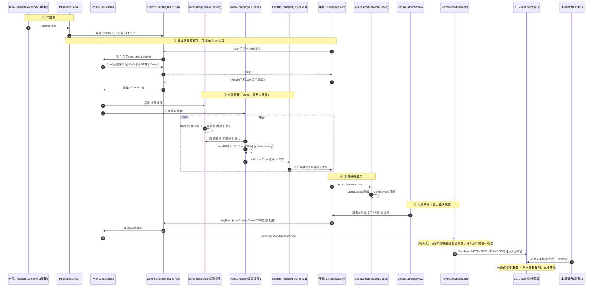
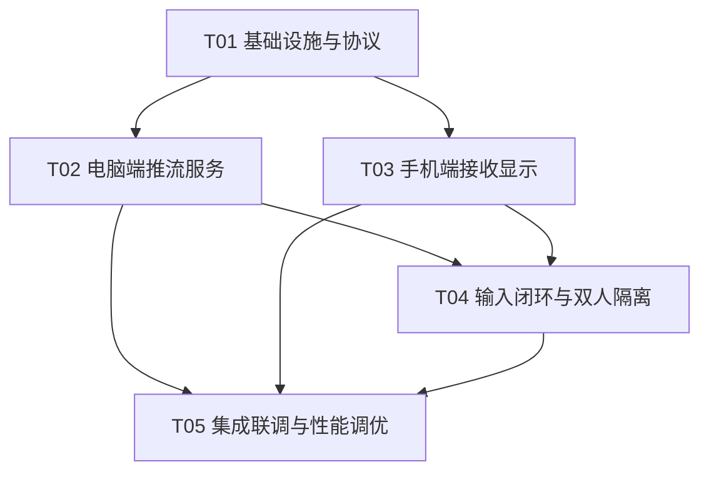

# 「手机盒子」系统设计文档（YeyouPlusPlus）

> 版本：v1.0（设计稿）
> 作者：software-architect（Bob）
> 需求依据：PRD（software-product-manager）+ 用户已拍板决策（仅 Android / 不自建服务器 / WebRTC+免费STUN 打洞、失败提示不上 TURN）
> 状态：设计阶段，不写实现代码

---

## 0. 结论速览（TL;DR）

| 决策点 | 结论 |
|--------|------|
| (a) 视频传输 | **P0 局域网：自研极简 UDP RTP（H.264 over UDP）；P1 跨网络：WebRTC**，二者通过 `IStreamTransport` 接口统一抽象（**分套，非统一 WebRTC**） |
| (b) 视频编码 | **FFmpeg.AutoGen 统一接入 avcodec**，硬编优先（NVENC → QSV → AMF）→ 软编兜底（**OpenH264**，规避 libx264 的 GPL 许可问题）；捕获用 **BitBlt + DIB Section**（比 Graphics.CopyFromScreen 快），30fps、最新帧丢弃策略 |
| (c) 手机端 | **Android 原生 Kotlin**（MediaCodec 硬解 + SurfaceView 零拷贝直出），不用 Flutter |
| 网络拓扑 | 电脑即"服务器"：**1 条 TCP 控制/按键通道 + 1 条 UDP 媒体通道**，零外网依赖 |
| 双人输入隔离 | P0 采用**键位映射空间分离**（玩家1/玩家2 映射不相交键集合）+ SendInput 用 `KEYEVENTF_SCANCODE` 物理码注入；P1 可选 LLKHF_INJECTED 严格区分 |
| 延迟保障 | 画面 <100ms（预算约 15~35ms）、按键 <50ms（预算约 23~46ms），端到端往返 <150ms 达标 |

---

## 1. 实现方案与框架选型

### 1.1 总体架构

```
┌───────────────────────────── 电脑端（Windows, C# net462 WPF）─────────────────────────────┐
│  UI 层      PhoneBoxWindow（开/关服务、显示 IP:端口、分辨率/帧率/码率设置、状态/统计）        │
│  服务层      PhoneBoxServer ── PhoneBoxSession（会话状态机）                                │
│  视频下行    ScreenCapturer(BitBlt) → VideoEncoder(FFmpeg H.264) → RtpPacketizer → UdpRtpTransport │
│  输入上行    ControlChannel(TCP 接收按键) → RemoteInputSimulator(SendInput 模拟)           │
│  抽象层      IStreamTransport（P0=UdpRtpTransport；P1=WebRtcTransport 插拔）               │
└───────────────────────────────┬──────────────────────────────┬───────────────────────────┘
                     TCP 控制/按键通道(8760)          UDP 媒体通道(8761, RTP/H.264)
                                │                              │
┌───────────────────────────────┴──────────────────────────────┴───────────────────────────┐
│  手机端（Android 原生 Kotlin, minSdk 24）                                                  │
│  StreamingClient ── ControlChannel(TCP) ── KeyEventSender ── VirtualGamepadView(玩家2手柄) │
│                   └─ VideoDecoder(MediaCodec 硬解) → SurfaceView(横屏全屏)                │
│                   └─ RtpDepacketizer(RTP→Annex-B NALU)                                    │
└───────────────────────────────────────────────────────────────────────────────────────────┘
```

核心原则：**媒体走 UDP（低延迟、容忍少量丢包），控制/按键走 TCP（可靠、有序、低流量）**——经典"媒体/控制分离"，也是 P1 演进到 WebRTC（媒体 RTP + DataChannel 承载按键）的天然过渡。

### 1.2 关键选型 (a)：视频传输——局域网自研 UDP RTP，还是统一 WebRTC？

**推荐：分套。P0 局域网用「自研极简 UDP RTP」，P1 跨网络再加「WebRTC」，二者实现同一 `IStreamTransport` 接口。**

| 维度 | 方案 A：统一 WebRTC | 方案 B（推荐）：局域网 UDP RTP + 跨网络 WebRTC |
|------|--------------------|----------------------------------------------|
| 稳态媒体延迟 | 局域网 ~1ms（UDP/SRTP） | 局域网 ~1ms（UDP/RTP），**持平** |
| 连接建立延迟 | 需 DTLS 握手 + ICE，首次约 0.3~1s | 无握手，TCP 控制通道即连即推，**<50ms 即可出画面** |
| 实现复杂度（C# 侧） | 高：DTLS、SRTP、ICE、SDP 全套，且 **C# net462 生态薄弱**（libwebrtc 无官方 .NET 绑定） | P0 低：RTP 头 + H.264 FU-A 分片 + 一个 recv/send 线程，约 300~500 行 C# |
| 与"不要服务器"兼容 | 兼容（局域网电脑即信令源），但为省那点复杂度不值 | **完全兼容**：电脑进程本身承载信令，零外网依赖 |
| 跨网络 | 原生支持 | P1 通过 `IStreamTransport` 插拔 WebRTC，复用上层全部代码 |
| 手机端配套 | org.webrtc 官方库（重） | P0 用原生 UDP Socket + MediaCodec（轻、延迟更低） |

**理由展开：**

1. **P0 只做局域网，WebRTC 的价值（NAT 打洞、拥塞控制、跨网）在局域网里全是负资产。** 局域网 UDP 丢包率 <0.1%、RTT <1ms，不需要 GCC/NACK/RTX/FEC 那一整套；反而 DTLS 握手、SDP 协商凭空增加几百毫秒连接延迟与大量集成风险。
2. **C# net462 的 WebRTC 库选型是硬伤。** 可选项：SIPSorcery（纯 C#，偏底层、需自己接媒体帧）、libdatachannel P/Invoke 封装（C++ 库，绑定工作量大）、Windows MixedReality WebRTC（已停止维护、WinRT 面向、net462 桌面不友好）。在 P0 就背上这套，会显著拖慢"最小闭环"的交付。
3. **自研 UDP RTP 是 WebRTC 的技术底座**（RTP 封装、H.264 FU-A 分片、SSRC 这些概念 WebRTC 一样用），P1 加 WebRTC 时认知与代码可复用。
4. **零服务器约束天然满足**：局域网下电脑进程就是"服务器"，手机输 IP:端口直连；跨网络下两端仍需交换 SDP，本设计 P1 采用"连接码 + 免费 STUN + 手动/剪贴板信令"，打洞失败即提示、不上 TURN——完全不引入自建服务器（详见 §1.6 与 §8 待明确）。

**为什么不推荐"WebSocket + 手写 H.264 over TCP"？** TCP 虽实现最简，但存在队头阻塞 + 延迟 ACK/Nagle 的固有延迟风险（须关 Nagle + 精细处理 ACK 才能压到 <40ms），且**为 P1 跨网络（必须 UDP）铺路价值为负**。UDP RTP 用稍多一点成本换掉这些坑，并直接对齐 WebRTC。**P0 提供 `UdpRtpTransport` 为主，设计里保留一个 `TcpFallbackTransport` 作为极端网络环境（UDP 被防火墙屏蔽）的降级兜底**（可选实现，非 P0 必做）。

### 1.3 关键选型 (b)：视频编码——硬编还是软编，C# 如何接入

**推荐：FFmpeg.AutoGen（NuGet）统一接入 avcodec；编码器优先级 硬编 NVENC → QSV → AMF → 软编 OpenH264 兜底；捕获用 BitBlt + DIB Section。**

**(1) 硬编 vs 软编**

- **硬编（NVENC/Intel QSV/AMD AMF）**：720p/30fps 单帧编码约 **2~6ms**，CPU 占用几乎为零——对「Flash 游戏 + 变速齿轮 + 影子多开」场景是刚需（绝不能抢游戏的 CPU）。三者都通过 FFmpeg 的 `h264_nvenc` / `h264_qsv` / `h264_amf` 暴露，一次接入全部覆盖。
- **软编兜底**：老机器/核显没有可用硬编时，用 **OpenH264（Cisco，BSD 许可）** 而非 libx264。原因：**libx264 是 GPL 许可，闭源分发有传染风险；OpenH264 是 BSD，可安全打包**。OpenH264 baseline/constrained-baseline 720p 也可做到 5~10ms。
- **关键编码参数（延迟核心）**：`preset=ultrafast / tune=zerolatency`、**关闭 B 帧（bf=0）**、`gop` 适度（如 60）、profile = baseline/constrained-baseline（手机硬解兼容性最好）、码率 2~8 Mbps 可配。B 帧是编码延迟与随机访问的大头，必须关闭。

**(2) C# 如何接入编码（排除 FFmpeg 子进程）**

- ❌ **FFmpeg 子进程（stdin/stdout 传帧）不推荐**：720p BGRA 原始帧约 1MB/帧 × 30fps = 30MB/s 的进程间管道拷贝 + 调度，延迟与 CPU 开销都不可接受；更适合离线转码。
- ✅ **FFmpeg.AutoGen（P/Invoke 直调 avcodec）推荐**：NuGet 包 `FFmpeg.AutoGen` 提供 C# 到 libavcodec/libswscale 的自动绑定，可直接 `avcodec_open2` + `avcodec_send_frame/avcodec_receive_packet`（现代低延迟编码 API），并用 `sws_scale` 做 BGRA→NV12/YUV420P 转换。一次接入同时获得"硬编 + 软编 + 颜色空间转换"。
- 备选：**Media Foundation 硬编 MFT**（Windows 原生、零额外 DLL，但异步 MFT 事件模型繁琐、偏转码、踩坑多），以及**直接 P/Invoke libx264**（GPL 许可排除）。均不作为主方案。

**(3) 屏幕捕获与降延迟策略**

- 项目已知经验：**PrintWindow 对 GPU 合成的 CEF 窗口不可靠，必须 CopyFromScreen（GDI BitBlt）**。本设计进一步优化：
  - 用 **P/Invoke `BitBlt` 到 `CreateDIBSection` 预分配的 DIB**，直接拿像素指针转 YUV，比 `Graphics.CopyFromScreen`（GDI+ 封装、多一次拷贝）更快，720p 约 2~4ms。
  - **只捕获目标游戏窗口的屏幕矩形**（`GetWindowRect` 拿 CEF 浏览器窗口坐标），不做全屏捕获，减少像素量与耗时。
  - **独立捕获线程** + **最新帧单缓冲**（volatile 引用交换，编码线程永远取"最新一帧"，**丢弃过期帧**）——这是低延迟推流的命门，绝不排队积压。
  - 帧率固定 30fps（可配 15/30/60），捕获循环与编码循环解耦。
  - ⚠️ 已知风险：CEF 是 GPU 合成，Flash 画面是否落在系统合成表面、CopyFromScreen 能否抓到（是否会黑屏/漏帧），**必须在 P0 第一周做技术验证（spike）**；必要时对目标窗口关闭 GPU 合成或让 Flash 走软件渲染（见 §8）。

### 1.4 关键选型 (c)：手机端——原生 Kotlin vs Flutter

**推荐：Android 原生 Kotlin（单端）。**

| 维度 | 原生 Kotlin | Flutter |
|------|------------|---------|
| H.264 硬解延迟 | **MediaCodec + SurfaceView 直出（`configure(surface,...)`），解码帧零拷贝上屏**，5~15ms | 需 PlatformView 嵌入 TextureView/外接纹理，多一次合成/拷贝 + 平台通道开销 |
| UDP/TCP | Java NIO / Socket 原生，成熟 | dart:io 需走 isolate，低延迟场景要额外小心 |
| WebRTC（P1） | `org.webrtc:libwebrtc`（Google 官方，MediaCodec 硬解） | flutter_webrtc（再封装，多一层） |
| 单端复用价值 | 无（iOS 明确后续） | 唯一优势是将来 iOS，但用户已明确"iOS 后续再说" |
| 团队/生态 | Kotlin 通用、资料多、虚拟按键/触控控制精细 | Dart 需额外学习成本 |

**结论**：低延迟视频解码 + 虚拟手柄是本功能的核心，Flutter 的平台通道/外接纹理恰是这两点的负资产，跨端收益又被"先只做 Android"抵消。选原生 Kotlin（`Kotlin + AndroidX，minSdk 24 / targetSdk 34，单 Activity 横屏`）。

### 1.5 延迟预算与架构保障（硬指标 <150ms 如何被保障）

**画面（电脑→手机）目标 <100ms，预算合计约 15~35ms：**

| 阶段 | 预算 | 实现手段 |
|------|------|----------|
| 捕获（BitBlt → DIB） | 2~4ms | 只抓窗口矩形、复用 DIB、独立捕获线程 |
| BGRA→NV12 | 1~2ms | sws_scale，编码线程内 |
| H.264 编码 | 3~8ms | 硬编 zerolatency、无 B 帧 |
| RTP 封装 + UDP 发送 | <1ms | 局域网 |
| 网络 + 抖动缓冲 | 2~5ms | jitter buffer 最小（0~16ms，可配） |
| MediaCodec 硬解 + 上屏 | 5~15ms | Surface 直出、low-latency 模式 |

**按键（手机→电脑）目标 <50ms，预算合计约 23~46ms：**

| 阶段 | 预算 | 实现手段 |
|------|------|----------|
| 触摸回调 | 5~10ms | `onTouch` 内直接发事件，不合并、不做手势识别（P0） |
| TCP 发送 | <1ms | `Socket.TcpNoDelay=true` |
| 电脑接收 → SendInput | 1~2ms | 接收线程**直接**调 SendInput，不跨线程排队 |
| Flash 处理（1 帧） | 16~33ms | 受游戏自身帧率限制，无法压缩 |

**端到端往返**（玩家2按键 → 游戏响应 → 画面回传 → 眼睛看到）≈ 按键 30 + 游戏帧 16~33 + 画面 20~30 ≈ **66~93ms，<150ms 达标**，余量充足。主要不确定项：CEF/Flash 的 CopyFromScreen 兼容性与 GPU 合成 vsync 引入的 1~2 帧（16~33ms）。

### 1.6 网络拓扑与"不要服务器"落地方案

- **P0 局域网（纯本地，零服务器）**：
  - 电脑端 `PhoneBoxServer` 监听 **TCP 控制端口 8760** + **UDP 媒体端口 8761**（端口可配）。
  - 手机端输入 `IP:端口` → TCP 连上即完成握手（Hello/Config/Ready），电脑开始向手机报告的 UDP 端口推流。
  - 电脑窗口直接显示本机局域网 IP 与端口（P1 再加二维码/连接码）。
- **P1 跨网络（WebRTC + 免费 STUN，零自建服务器）**：
  - 媒体：`WebRtcTransport` 实现 `IStreamTransport`，用免费公共 STUN（如 `stun.l.google.com:19302`）收集 ICE 候选，尝试 P2P 打洞。
  - 信令：**不打洞前的 SDP 交换**——采用「连接码 + 剪贴板/IM 手动传递 SDP」的零服务器信令（两端各自生成本地 offer/answer，用户复制粘贴一次）；打洞失败 → UI 提示"无法直连，建议回到局域网"，**不上 TURN 中继**。
  - ⚠️ 明确代价：零服务器意味着跨网络首次配对需用户手动传一次 SDP（体验不如一键连接码）。若要"一键连接码"体验，需要一个极轻量的公共信令中继（第三方或自建，用户已拒绝自建）——此取舍在 §8 待明确。

---

## 2. 文件列表

### 2.1 电脑端新增（`cs/src/PhoneBox/`，命名空间 `YeyouPlusPlus.PhoneBox`）

| 文件 | 职责 |
|------|------|
| `cs/src/PhoneBox/PhoneBoxWindow.xaml` | 手机盒子主窗口 UI（开关、IP:端口/连接码显示、分辨率/帧率/码率/编码器下拉、状态灯、统计） |
| `cs/src/PhoneBox/PhoneBoxWindow.xaml.cs` | 窗口逻辑：绑定 `PhoneBoxServer` 生命周期、把服务事件/统计 marsh 回 UI 线程 |
| `cs/src/PhoneBox/PhoneBoxServer.cs` | 服务入口：监听 TCP 控制端口、分配 UDP 媒体端口、创建/销毁 `PhoneBoxSession` |
| `cs/src/PhoneBox/PhoneBoxSession.cs` | 单个手机连接的会话状态机（Idle→Handshake→Streaming→Closed），编排各子组件 |
| `cs/src/PhoneBox/StreamingService.cs` | 推流编排：启动捕获/编码线程、驱动"捕获→编码→分片→发送"流水线、控制帧率 |
| `cs/src/PhoneBox/ScreenCapturer.cs` | BitBlt + DIB Section 捕获目标窗口矩形，产出 BGRA 帧；最新帧单缓冲 |
| `cs/src/PhoneBox/VideoEncoder.cs` | FFmpeg.AutoGen 封装：avcodec 硬编/软编 H.264 + sws_scale BGRA→NV12 |
| `cs/src/PhoneBox/RtpPacketizer.cs` | H.264 Annex-B NALU → RTP（FU-A 分片）封装 |
| `cs/src/PhoneBox/UdpRtpTransport.cs` | UDP RTP 发送（含远端端点、发送统计）；实现 `IStreamTransport` |
| `cs/src/PhoneBox/IStreamTransport.cs` | 传输抽象接口（`Connect/Send/Close/Stats`），P0=UDP、P1=WebRTC 插拔 |
| `cs/src/PhoneBox/ControlChannel.cs` | TCP 控制通道：握手编解码、按键事件接收、向手机回推配置/状态 |
| `cs/src/PhoneBox/RemoteInputSimulator.cs` | SendInput P/Invoke 封装：`SendKeyDown/Up/Tap(scanCode)`，KEYEVENTF_SCANCODE |
| `cs/src/PhoneBox/PhoneBoxProtocol.cs` | 控制/按键消息协议常量与 DTO（Hello/Config/Ready/KeyEvent/Stats，JSON） |
| `cs/src/PhoneBox/PhoneBoxConfig.cs` | 运行参数（端口/分辨率/帧率/码率/编码器）+ 序列化 |
| `cs/src/PhoneBox/PhoneBoxLog.cs` | 简易日志（写 `AppPaths.DataDir\logs\phonebox.log`，带时间戳） |

> 说明：`SendInput` 目前代码库内无既有实现（已 grep 确认），本设计新增 `RemoteInputSimulator` 自包含实现；若后续发现已有"文字上屏"输入实现，应抽取复用其 SendInput 封装。

### 2.2 手机端 Android 工程（建议独立目录 `android/`，包名 `com.yeyou.phonebox`）

| 文件 | 职责 |
|------|------|
| `android/settings.gradle` | 工程根配置（include :app） |
| `android/build.gradle` | 顶层构建脚本（插件版本、仓库） |
| `android/gradle.properties` | Gradle 属性（AndroidX、内存） |
| `android/app/build.gradle` | 应用构建（依赖、minSdk 24 / targetSdk 34、Kotlin） |
| `android/app/src/main/AndroidManifest.xml` | 声明（横屏 Activity、INTERNET 权限、设备方向锁定） |
| `android/app/src/main/java/com/yeyou/phonebox/MainActivity.kt` | 单 Activity：横屏、持有 SurfaceView + VirtualGamepadView、连接 UI（IP/端口输入） |
| `android/app/src/main/java/com/yeyou/phonebox/StreamingClient.kt` | 客户端编排：创建控制通道、启动接收/解码线程、转发按键 |
| `android/app/src/main/java/com/yeyou/phonebox/ControlChannel.kt` | TCP 控制通道（握手/按键上报/状态），TcpNoDelay |
| `android/app/src/main/java/com/yeyou/phonebox/VideoDecoder.kt` | MediaCodec H.264 硬解 → Surface |
| `android/app/src/main/java/com/yeyou/phonebox/RtpDepacketizer.kt` | RTP → Annex-B NALU 重组 |
| `android/app/src/main/java/com/yeyou/phonebox/VirtualGamepadView.kt` | 虚拟按键 Overlay（多点触控，按下/抬起回调，P1 扩展拖动/改大小/绑键） |
| `android/app/src/main/java/com/yeyou/phonebox/KeyLayout.kt` | 按键布局数据模型 + 键码映射（默认玩家2键位，JSON 持久化预留） |
| `android/app/src/main/java/com/yeyou/phonebox/KeyEventSender.kt` | 按键事件编码为协议消息并通过控制通道发送 |
| `android/app/src/main/java/com/yeyou/phonebox/Log.kt` | 简易日志（Logcat + 可选文件） |
| `android/app/src/main/res/layout/activity_main.xml` | 主界面布局（SurfaceView + 虚拟手柄 Overlay + 连接面板） |
| `android/app/src/main/res/values/strings.xml` 等 | 资源（文案、主题、横屏） |

### 2.3 项目根目录新增

| 文件 | 职责 |
|------|------|
| `docs/system_design.md` | 本设计文档 |
| `docs/class-diagram.mermaid` | 类图（mermaid） |
| `docs/sequence-diagram.mermaid` | 时序图（mermaid） |
| `cs/ffmpeg/README.md`（或 `THIRD_PARTY_NOTICES` 增补） | 说明 FFmpeg native DLL 的来源/许可（LGPL 构建，见 §7）与打包位置 |

---

## 3. 数据结构和接口（类图）

> 完整 mermaid 另存 `docs/class-diagram.mermaid`。C# 与 Kotlin 分属两个进程，通过网络协议（TCP/UDP）交互。

```mermaid
classDiagram
    direction TB

    %% ================= 电脑端 C# (YeyouPlusPlus.PhoneBox) =================
    class PhoneBoxServer {
        -TcpListener _controlListener
        -UdpClient _mediaClient
        -PhoneBoxSession _session
        +Start(PhoneBoxConfig cfg) void
        +Stop() void
        +event Action~string~ StateChanged
    }
    class PhoneBoxSession {
        +string SessionId
        +PhoneBoxState State
        +ControlChannel Control
        +StreamingService Streaming
        +RemoteInputSimulator Input
        +Start() void
        +OnKeyEvent(KeyEventDto e) void
        +UpdateConfig(PhoneBoxConfig cfg) void
    }
    class StreamingService {
        -ScreenCapturer _capturer
        -VideoEncoder _encoder
        -RtpPacketizer _packetizer
        -IStreamTransport _transport
        +Start() void
        +Stop() void
        -CaptureLoop() void
        -EncodeLoop() void
    }
    class ScreenCapturer {
        -IntPtr _hWnd
        -IntPtr _dib
        -Bitmap _latest
        +IntPtr TargetHwnd
        +CaptureFrame() void
        +GetLatestFrame() Frame
    }
    class VideoEncoder {
        -AVCodecContext* _ctx
        -SwsContext* _sws
        +Init(int w, int h, int fps, int kbps, string encoder) bool
        +Encode(Frame f) Packet[]
        +Close() void
    }
    class RtpPacketizer {
        +Packetize(byte[] nalu, int mtu) RtpPacket[]
    }
    class IStreamTransport {
        <<interface>>
        +Connect(EndPoint remote) void
        +Send(byte[] data, int len) void
        +Close() void
        +Stats GetStats()
    }
    class UdpRtpTransport {
        -UdpClient _udp
        +Connect(EndPoint remote) void
        +Send(byte[] data, int len) void
        +Close() void
        +Stats GetStats()
    }
    class ControlChannel {
        -TcpClient _client
        -NetworkStream _stream
        +Start() void
        +Send(object msg) void
        +event Action~KeyEventDto~ KeyReceived
        +event Action~HelloDto~ HelloReceived
    }
    class RemoteInputSimulator {
        +SendKeyDown(ushort scanCode) void
        +SendKeyUp(ushort scanCode) void
        +SendKeyTap(ushort scanCode) void
    }
    class PhoneBoxProtocol {
        +static string Serialize(object msg)
        +static object Deserialize(string json)
    }
    class PhoneBoxConfig {
        +int ControlPort
        +int MediaPort
        +int Width
        +int Height
        +int Fps
        +int BitrateKbps
        +string Encoder
    }
    class KeyEventDto {
        +ushort ScanCode
        +bool IsDown
        +long Timestamp
    }

    %% ================= 手机端 Android Kotlin (com.yeyou.phonebox) =================
    class MainActivity {
        +SurfaceView surface
        +VirtualGamepadView gamepad
        +StreamingClient client
        +onConnect(host, port) void
    }
    class StreamingClient {
        +ControlChannel control
        +VideoDecoder decoder
        +RtpDepacketizer depacketizer
        +start(host, port) void
        +stop() void
    }
    class ControlChannel {
        +Socket socket
        +connect(host, port) void
        +sendKeyEvent(KeyEventDto e) void
        +event onConfig(ConfigDto)
        +event onState(StateDto)
    }
    class VideoDecoder {
        +MediaCodec codec
        +configure(Surface s, int w, int h) void
        +feed(byte[] nalu) void
        +start() void
        +release() void
    }
    class RtpDepacketizer {
        +push(byte[] rtp) Nalu[]
    }
    class VirtualGamepadView {
        +KeyLayout layout
        +event onKey(ushort scanCode, bool isDown)
        +loadLayout(KeyLayout l) void
    }
    class KeyLayout {
        +List~KeyButton~ buttons
        +load() void
        +save() void
    }
    class KeyButton {
        +int id
        +float x
        +float y
        +float w
        +float h
        +ushort scanCode
    }

    %% ================= 关系 =================
    PhoneBoxServer --> PhoneBoxSession : "1..1 管理"
    PhoneBoxSession --> ControlChannel : "持有"
    PhoneBoxSession --> StreamingService : "持有"
    PhoneBoxSession --> RemoteInputSimulator : "持有"
    StreamingService --> ScreenCapturer : "取帧"
    StreamingService --> VideoEncoder : "编码"
    StreamingService --> RtpPacketizer : "分片"
    StreamingService --> IStreamTransport : "发送"
    UdpRtpTransport ..|> IStreamTransport : "实现(P0)"
    ControlChannel ..> PhoneBoxProtocol : "编解码"
    ControlChannel ..> KeyEventDto : "解析"
    RemoteInputSimulator ..> KeyEventDto : "注入"

    MainActivity --> StreamingClient : "持有"
    MainActivity --> VirtualGamepadView : "持有"
    StreamingClient --> ControlChannel : "控制/按键"
    StreamingClient --> VideoDecoder : "解码"
    StreamingClient --> RtpDepacketizer : "重组"
    VirtualGamepadView --> KeyLayout : "布局"
    KeyLayout --> KeyButton : "包含"
    ControlChannel ..> KeyEventDto : "上报"

    note for PhoneBoxSession "会话状态机: Idle→Handshake→Streaming→Closed"
    note for IStreamTransport "P1 新增 WebRtcTransport 实现同一接口"
```



---

## 4. 程序调用流程（时序图）与双人输入隔离

> 完整 mermaid 另存 `docs/sequence-diagram.mermaid`。



### 4.1 双人输入隔离方案（P0 难点）

**问题本质**：Flash 页游的"双人"通常是**两套不相交的键位控制两个角色**（如玩家1 = WASD+JKL，玩家2 = 方向键+小键盘）。SendInput 注入的按键与真实键盘最终都变成 `WM_KEYDOWN`，Flash 本身**不区分来源**。因此"隔离"的语义 = **保证两个输入源永远触发各自的键位集合，且互不越界**。

**P0 方案（务实、足够）：键位映射空间分离 + 物理码注入**

1. **映射空间分离**：`KeyLayout` 中玩家2 的虚拟按键绑定的 scanCode 集合，与玩家1 本机常用键位（游戏默认玩家1键）**强制不相交**；默认给玩家2 预置一套"方向键+小键盘+ZXC"键位，UI 上提示用户不要与玩家1 冲突（P1 再做冲突检测与自定义绑键）。
2. **物理码注入**：`RemoteInputSimulator` 使用 `SendInput` + `KEYEVENTF_SCANCODE`（`KEYBDINPUT.wScan` 传硬件扫描码，而非 `wVk` 虚拟键），绕开输入法/键盘布局/焦点差异，直接命中 Flash 的键盘扫描码处理，按下/抬起成对发送。
3. **焦点保障**：注入前确保游戏窗口为前台（`SetForegroundWindow`，必要时 `AttachThreadInput`），并在 UI 提示"投屏期间保持游戏窗口可见/前台"；否则注入键会落错窗口。
4. **低延迟路径**：按键在电脑接收线程**直接**调 `SendInput`，不做跨线程排队；`KeyEvent` 带毫秒时间戳与序号，便于诊断。

**P1 可选增强（严格区分来源，非 P0 必做）**：如需"两个玩家可映射到同一物理键但由系统区分来源"，可装全局 `WH_KEYBOARD_LL` 钩子，利用 `KBDLLHOOKSTRUCT.flags & LLKHF_INJECTED` 识别"注入键=玩家2 / 真实键=玩家1"并做键位翻译。但这对 Flash 页游意义有限（同一键无法同时驱动两个角色），故 P0 不做。

---

## 5. 任务列表（Part B）

> 说明：本设计任务列表聚焦 **P0 局域网最小闭环**。任务按依赖排序，T02/T03 可并行（都仅依赖 T01 的协议定义）。P1/P2 规划见 §5.6。

### 5.1 依赖包

**电脑端 NuGet（cs/src/YeyouPlusPlus.csproj 追加）：**
```
- FFmpeg.AutoGen@^7.0        # avcodec/avformat/swscale P/Invoke 绑定（编码核心）
- System.Memory@^4.5.5       # net462 下 Span/Memory 支持（FFmpeg.AutoGen 依赖）
- System.Runtime.CompilerServices.Unsafe@^6.0   # 同上依赖
- System.Buffers@^4.5.1      # 同上依赖
- Newtonsoft.Json@13.0.3     # 已有，复用（协议 JSON）
```
> FFmpeg native 库（avcodec-*.dll / swscale-*.dll / avutil-*.dll，**LGPL 构建**，含硬编 h264_nvenc/qsv/amf 与软编 libopenh264）需随安装包分发到 `plugins/ffmpeg/`，来源与许可见 §7/§8。

**手机端 Gradle（android/app/build.gradle）：**
```
- org.jetbrains.kotlin:kotlin-stdlib
- androidx.core:core-ktx
- androidx.appcompat:appcompat
- androidx.lifecycle:lifecycle-viewmodel-ktx
- com.google.android.material:material
- （P1）org.webrtc:libwebrtc   # 跨网络，P0 不需要
```
> 视频解码（MediaCodec）、渲染（SurfaceView）、网络（Socket/DatagramSocket）均为 Android SDK 自带，无第三方依赖。

### 5.2 任务 T01：基础设施与通信协议（两端骨架）

- **做什么**：电脑端 csproj 追加 NuGet 依赖，新建 `PhoneBox` 命名空间骨架（协议 DTO、配置、日志）；手机端初始化 `android/` Gradle 工程（空壳 MainActivity + Manifest 横屏）；定义并冻结握手协议（Hello/Config/Ready/KeyEvent/Stats 的 JSON 字段与版本号）。
- **文件**：`cs/src/YeyouPlusPlus.csproj`、`PhoneBoxProtocol.cs`、`PhoneBoxConfig.cs`、`PhoneBoxLog.cs`、`android/{settings.gradle,build.gradle,gradle.properties,app/build.gradle,AndroidManifest.xml,MainActivity.kt(空壳),res/layout/activity_main.xml}`
- **验收标准**：两端工程可编译/构建；电脑端能打印一条 phonebox 日志；手机空壳 APK 可安装并横屏启动；协议字段评审冻结。
- **依赖**：无（起点）。
- **优先级**：P0

### 5.3 任务 T02：电脑端推流服务（视频下行）

- **做什么**：实现 `PhoneBoxServer`/`PhoneBoxSession`（TCP 监听 + 会话状态机）、`ControlChannel`（握手 + 通道管理，按键接收留回调位）、`ScreenCapturer`（BitBlt+DIB）、`VideoEncoder`（FFmpeg.AutoGen 硬编优先/软编兜底）、`RtpPacketizer`、`UdpRtpTransport`、`StreamingService`（捕获/编码流水线）。
- **文件**：`PhoneBoxServer.cs`、`PhoneBoxSession.cs`、`ControlChannel.cs`、`ScreenCapturer.cs`、`VideoEncoder.cs`、`RtpPacketizer.cs`、`IStreamTransport.cs`、`UdpRtpTransport.cs`、`StreamingService.cs`
- **验收标准**：电脑开服务后，可用 `ffprobe`/VLC 或临时手机接收端收到合法 H.264 RTP 流；编码器硬编探测成功、软编兜底可用；捕获/编码线程不阻塞 UI；目标窗口被遮挡时能明确报错/提示。
- **依赖**：T01。
- **优先级**：P0

### 5.4 任务 T03：手机端接收解码显示（视频下行）

- **做什么**：实现手机端 `ControlChannel`（握手）、`RtpDepacketizer`、`VideoDecoder`（MediaCodec 硬解 → Surface）、`StreamingClient` 编排、`MainActivity` 完整连接 UI（IP/端口输入 + 连接状态）。
- **文件**：`StreamingClient.kt`、`ControlChannel.kt`、`VideoDecoder.kt`、`RtpDepacketizer.kt`、`MainActivity.kt`、`activity_main.xml`、`Log.kt`
- **验收标准**：手机输入电脑 IP:端口后，横屏流畅显示电脑画面（无花屏/无累积延迟），30fps 稳定；断线/连接失败有明确 UI 提示。
- **依赖**：T01（协议）。可与 T02 并行（用 T02 完成后的电脑端联调）。
- **优先级**：P0

### 5.5 任务 T04：输入闭环与双人隔离（输入上行）

- **做什么**：手机端 `VirtualGamepadView`（多点触控按下/抬起）、`KeyLayout`（默认玩家2键位）、`KeyEventSender`；电脑端 `RemoteInputSimulator`（SendInput/SCANCODE）+ `ControlChannel` 按键事件回调接线；实现**键位映射空间分离**的隔离策略与焦点保障。
- **文件**：`VirtualGamepadView.kt`、`KeyLayout.kt`、`KeyEventSender.kt`、`RemoteInputSimulator.cs`、`ControlChannel.cs`（补按键接线）、`PhoneBoxProtocol.cs`（补 KeyEvent）
- **验收标准**：手机虚拟键按下/抬起，电脑端游戏内玩家2角色即时响应（<50ms）；本机键盘玩家1 操作不受影响、两路键位不串扰；按键日志可追溯（时间戳/序号）。
- **依赖**：T02、T03。
- **优先级**：P0

### 5.6 任务 T05：集成联调与性能调优（端到端 + 设置 UI）

- **做什么**：`PhoneBoxWindow` 完整 UI（参数设置、状态灯、统计/延迟显示）；端到端联调（同屏双人实测）；断线重连基础（手机自动重连）；按延迟预算逐段压测优化，达成 <150ms。
- **文件**：`PhoneBoxWindow.xaml`、`PhoneBoxWindow.xaml.cs`、`PhoneBoxConfig.cs`（完善持久化）、`PhoneBoxLog.cs`（统计）、`PhoneBoxServer.cs`（生命周期接入主窗口）
- **验收标准**：同屏双人可玩；画面+按键端到端往返 <150ms（局域网实测）；参数（分辨率/帧率/码率/编码器）可配并生效；服务开关/异常处理稳健。
- **依赖**：T02、T03、T04。
- **优先级**：P0

### 5.7 P1/P2 规划（占位，不在本次实现）

| 阶段 | 内容 |
|------|------|
| P1 | 二维码/连接码一键连接；跨网络 `WebRtcTransport`（SIPSorcery + 免费 STUN + 手动信令，打洞失败提示）；按键自定义布局（拖动/改大小/绑键 + 冲突检测）；延迟画质自适应（动态码率/帧率）；断线重连完善；LLKHF_INJECTED 严格输入隔离（可选） |
| P2 | iOS；每游戏独立按键布局 + 分享；高级按键（摇杆/组合键/连发/手势）；多手机（3人以上）；多分辨率适配 |

---

## 6. 共享知识（跨文件约定，工程师统一遵守）

- **命名规范**：电脑端新增代码统一命名空间 `YeyouPlusPlus.PhoneBox`，类名 PascalCase、私有字段 `_camelCase`（沿用现有风格）；手机端包 `com.yeyou.phonebox`，Kotlin 惯用命名。协议消息字段用 PascalCase JSON（与现有 Newtonsoft 序列化一致）。
- **线程模型（电脑端，5 类线程，禁止跨线程碰 UI 控件）**：
  - UI 线程（WPF Dispatcher）：窗口/控件；服务事件通过 `Dispatcher.Invoke/BeginInvoke` 回 UI。
  - 捕获线程：专用循环，BitBlt → 写入"最新帧"（volatile 引用交换，单写多读）。
  - 编码线程：专用循环，取最新帧（无新帧跳过/丢弃过期）→ 编码 → 分片 → 发送。
  - 网络线程：TCP 控制接收（异步 Socket 或专用线程）；UDP 发送由编码线程直接调用。
  - 输入线程：**按键在接收线程内直接 SendInput**，不跨线程排队（保 <50ms）。
- **错误处理**：网络/编码/捕获异常一律捕获、不崩主程序；编码失败自动降级软编；错误以"状态码 + 中文描述"回传 UI 与手机端；手机端连接失败/断线给出明确提示。
- **日志约定**：电脑端写 `AppPaths.DataDir\logs\phonebox.log`（时间戳 `HH:mm:ss.fff` + 级别 + 消息），关键路径（握手、编码器选择、每帧耗时、按键注入）打点；手机端 Logcat tag `PhoneBox`。
- **协议约定**：所有控制/按键消息走 TCP，JSON 文本 + `\n` 分行帧（简单可靠）；每条消息含 `type` 字段；视频走 UDP RTP（H.264 Annex-B → FU-A 分片，MTU=1200）；端口默认 8760(TCP)/8761(UDP)，可配。
- **数据持久化**：电脑端配置沿用 JSON（`AppPaths.DataDir\phonebox.json`）；手机端键位布局预留 JSON 持久化（P1）。
- **许可红线**：**禁用 libx264（GPL）**；软编兜底用 OpenH264（BSD）；FFmpeg 使用 LGPL 构建，随包附带第三方声明。

---

## 7. 待明确事项（技术风险点）

1. **CopyFromScreen 对 GPU 合成 CEF/Flash 画面的兼容性（最大风险）**：CEF 默认 GPU 合成，Flash 渲染可能不走系统可抓取的合成表面，导致黑屏/漏帧。需 P0 首周 spike 实测；必要时对目标窗口 `--disable-gpu-compositing` 或让 Flash 走软件渲染，并量化对游戏性能与画面质量的影响。
2. **变速齿轮/影子多开与捕获的相互作用**：变速只影响游戏内时间、理论上不影响捕获；但"影子多开"下存在多个 CEF 窗口，需明确"捕获哪个窗口"（建议捕获当前激活标签页/用户在 PhoneBox 窗口里指定目标窗口）。
3. **C# net462 下 FFmpeg.AutoGen 可用版本与 native DLL 分发**：确认 FFmpeg.AutoGen 7.x 对 net462 的兼容性；确认 LGPL 构建中 `h264_nvenc/qsv/amf` + `libopenh264` 可用；native DLL 的许可声明与打包路径。
4. **跨网络 WebRTC 在 C# net462 的库选型**：SIPSorcery（纯 C#、偏底层）vs libdatachannel P/Invoke 封装，需 P1 前做技术验证；以及"零服务器信令"的体验取舍（手动复制粘贴 SDP vs 一键连接码需要轻量公共信令中继）。
5. **手机端 MediaCodec H.264 profile 兼容性**：部分设备仅支持 baseline/constrained-baseline；需在 Config 协商中声明 profile，并做多设备实测。
6. **SendInput 注入 vs 真实键盘的严格区分需求**：LLKHF_INJECTED 方案是否有真实产品需求（取决于具体 Flash 游戏双人键位设定），P0 先用映射分离。
7. **Windows 防火墙/网络环境**：首次监听 UDP/TCP 需引导用户放行；企业网络/UDP 被屏蔽时的 TCP 降级兜底是否纳入 P0。
8. **延迟实测基准**：需定义统一测量方法（画面延迟用"电脑端时间戳水印/计数器帧"在手机端拍照比对；按键延迟用"按下→电脑端日志时间戳"），确保 <150ms 可复现验收。

---

## 8. 任务依赖图


